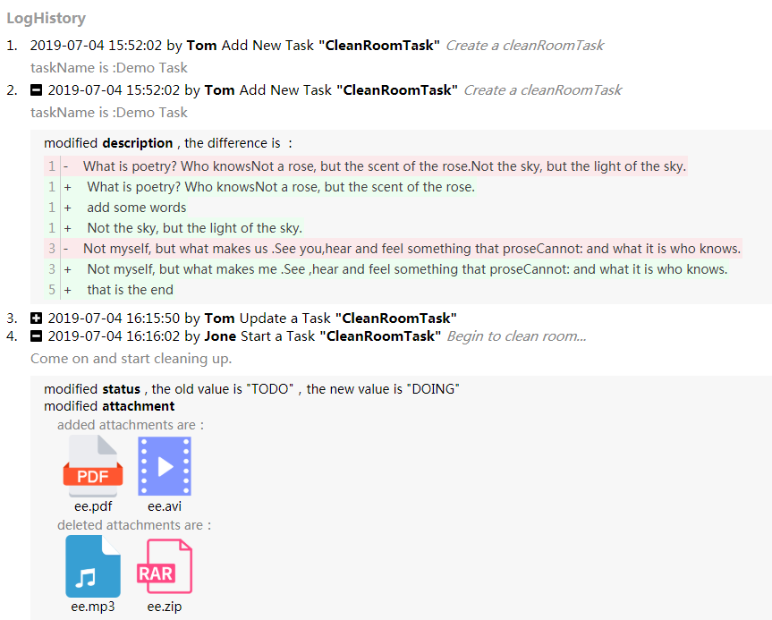

### 日志

日志在系统中是必不可少的功能模块，用于监控系统是否健康，还有排查问题，记录操作等重要的功能。

以下，我想自己设计设计一套自己的日志规范，用于自己的系统中。

我认为日志模块应该有两个必须要有的功能。

> 用户操作日志

说的明白点，就是用户在**什么模块**，**什么时间**，**做了什么**。

这个用户操作日志应该不限于普通的`oa`系统，应该只要是web项目就能够嵌入。

具体的界面应该是下面这样。

但实际的效果可能并没有这么多，最多只是记录了你什么时间在什么模块，做了什么，做了什么无非是crud，这里会记录你的做这些的状态，在新增删除修改的时候会记录的比较详细，查询这个功能，我不打算记录到用户操作模块，一个是查询没什么记录的，因为他是幂等的，即无论操作多少次结果都是一样的。

而查询虽然不会记录到用户操作日志中，但是查询却和**系统的性能**和**用户爱好热力分布**息息相关。所以我打算把查询重点放在系统日志中。

> 系统日志

系统日志不会记录那些很细节的操作，相反的，我觉得应该记录一些更加底层给系统维护者能看得懂的东西。

所以，系统日志里面，应该有些许的统计图。例如

* 一个月内，用户对那些模块进行了使用，可以对查看用户喜好情况，所谓的使用这一概念，我认为是进入了模块并进行了操作，我认为查询就是一个部件简单的使用规则，只要你进入了这个模块进行了查询，我就认为你使用了这个模块。
* 模块性能
  * 这个功能其实我很早就想做，具体的效果就是，我将系统里所有的controller中的路径全部扫描出来，这其实spring中是有的，需要想办法取出来**(等待验证)**
  * 接着，这个模块的性能需要如何评测出来，一个是在一个时间段的标准中，这里假设是一个月的时间，这个模块的总查询时间除以查询次数。这个可以做一个统计图
  * 其实，我希望将每个模块的每次查询都做一个统计，类似树结构，点下可以下拉更多细节，我觉得这个总查询时间不需要太准确。
* 异常捕获
  * 异常是我们排查问题的主要依据，因此每次发生的异常，我们都希望记录下来，又或者生成日志文件，可以提供下载。

再者，应该我觉得可以将功能做进和 `springboot starter` 包那种，开包即用效果，所以也可以用到一些spring中的日志系统，springboot中的本身的log依赖中，有实现了slf4j的logback的包。我们可以配置自己的log输出的日志。并且可以按照时间规则切文件。也可以规定输出日志格式，方便解析。也可以下载存储在服务器上的日志信息。

2021-04-07：以上是我构思的日志模块，后续如果发现还有好的功能，我会加进入。

